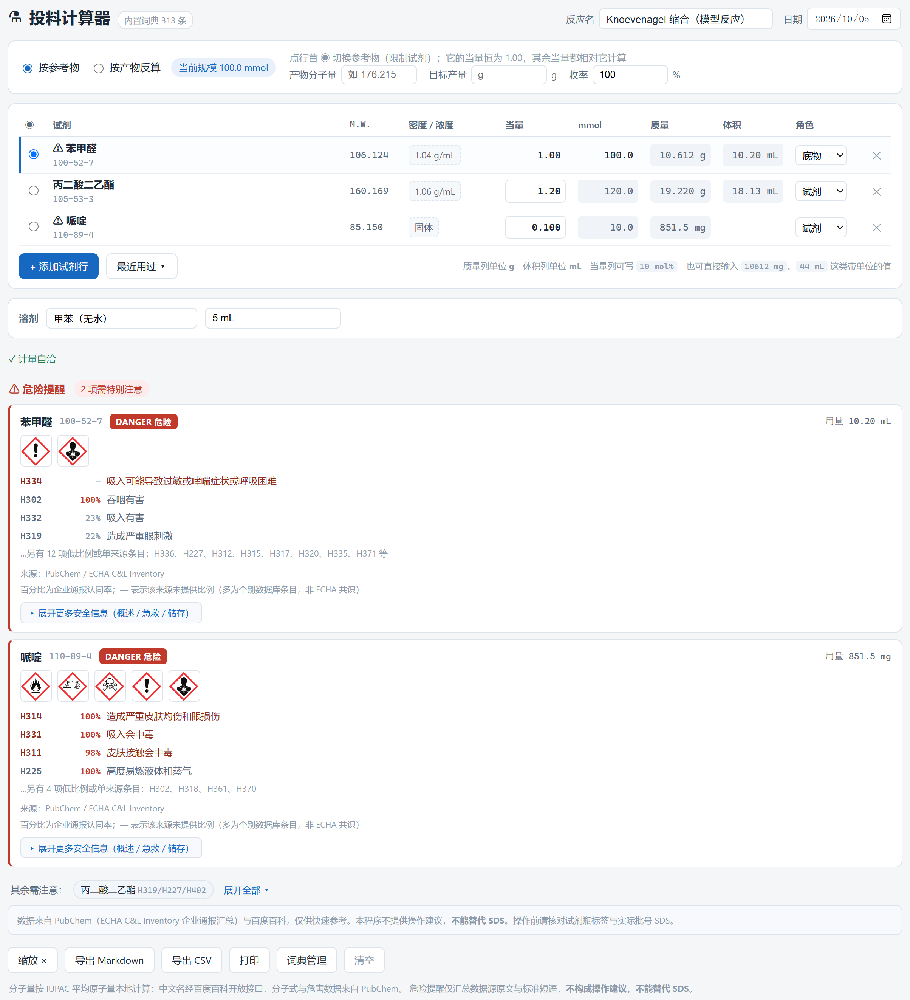
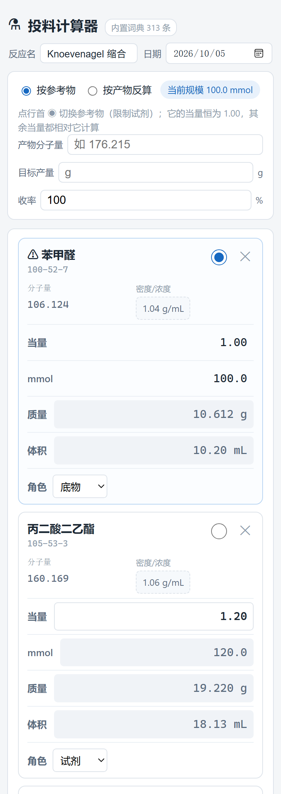

# 投料计算器

> 输入试剂的中文名或 CAS 号自动取分子量，填一部分数据就补全整张投料表，并汇总这批试剂里需要注意的危险提醒与淬灭提示。
>
> **单个 HTML 文件，零依赖，双击即用。**

*A lab-scale reaction charge calculator for bench chemists. Single-file HTML, no install, works offline.*

<p align="center">
  
</p>

---

## 它解决什么问题

称样前算投料量，通常要开三四个窗口：查分子量、查密度、算摩尔数、再拿计算器换一遍体积。试剂一多还容易算漏。

这个工具把这几步合成一步：

1. 输入**中文名**（`苯甲醛`）、**CAS 号**（`100-52-7`）、**分子式**（`C7H6O`）或英文名，自动查出分子量（溶液试剂还会带出常见商品浓度）
2. 在**当量 / mmol / 质量 / 体积**四列里，**随便填哪一格都行**
3. 整张表自动补齐 —— 包括反着算：给某个试剂的质量和当量，反推参考物，再算出其余全部

同时把这一批试剂里**需要特别注意的**挑出来放在底部：GHS 分类、H 代码、企业通报比例、象形图，以及反应性与淬灭提示。

---

## 功能

### 输入很宽容

| 你输入 | 识别为 |
|---|---|
| `苯甲醛` / `benzaldehyde` / `n-BuLi` | 中文名 / 英文名 / 缩写 |
| `100-52-7` | CAS 号（**自动验证校验位**，敲错会提示） |
| `C7H6O` | 分子式（本地按 IUPAC 原子量算，比查库更准） |
| `10612 mg` / `1.5 g` / `500 uL` / `0.2 L` | 带单位的数量，自动换算 |
| `10 mol%` / `10%` | 当量列的 mol% 写法，等价于 0.1 当量 |

摩尔质量和体积**每一格都直接带单位显示**（`10.612 g`、`44.00 mL`、`850.0 mg`、`4.9 µL` 会自动换档）。

### 任意填一格，全表补齐

四列数字之间用约束传播求解，支持这些填法：

| 你填 | 系统算出 |
|---|---|
| 参考物 mmol + 各行当量 | 所有 mmol / 质量 / 体积 |
| 参考物质量 | 摩尔数 → 其余全部 |
| 某试剂质量 + 它的当量 | **反推**参考物 → 其余全部 |
| 溶液试剂体积 + 浓度 | **反推**参考物 → 其余全部 |
| 产物分子量 + 目标产量 + 收率 | **从产物倒推**全部投料量 |
| 只有当量、没有任何绝对量 | ⛔ 明确提示补一个绝对量，不会算出一个假数字 |

### 溶液试剂（n-BuLi、LDA 这类）

选「溶液」形态、填浓度，体积按 `V = n / C` 算。内置 30 种常见试剂的商品浓度预置（n-BuLi 2.5 M / 1.6 M、LDA 2.0 M、DIBAL-H 1.0 M、MeMgBr 3.0 M …）。

> ⚠️ 浓度会随批号变化，投料前请改成试剂瓶标签上的实测值。

纯液体走的另一条公式 —— `V = 称量质量 / 密度`，其中称量质量已经按纯度折算过（含量 95% 的试剂，体积按折算后的称量质量算，而不是按摩尔数算）。

### 危险提醒

底部按试剂汇总，分两级：

- 🔴 **高危**：自燃、遇水放出易燃气体、剧毒、严重灼伤、致癌、生殖毒性、爆炸物
- 🟡 **其他危害**：易燃、有害、刺激、致敏、疑似致癌、环境危害

每条 H 代码后面括号里的百分比，是 **PubChem 汇总的 ECHA C&L Inventory 里有多少企业认同这个分类**：

```
H250   84%   暴露在空气中自燃            ← 绝大多数企业认同
H314   35%   造成严重皮肤灼伤和眼损伤     ← 仅部分企业认同
H360    —    可能对生育能力或胎儿造成伤害  ← 该来源未提供比例
```

按需还能展开 PubChem 汇总的**危害概述 / 反应性与稳定性 / 急救措施 / 储存与操作 / 灭火**原文（英文原文，不做翻译，避免引入错误）。

### 离线可用

内置 **313 条**常用试剂词典（含分子量、密度、GHS 分类、象形图），日常投料的试剂绝大多数在里面，**断网也能查、也能算**。

联网只是为了查词典里没有的试剂。离线时会在约 20 ms 内快速失败并明确提示，不会卡住。

> 实测方法：用 `--host-resolver-rules` 让所有域名解析失败，模拟真实断网，页面功能完整。

### 手机可用

同一个文件，手机浏览器打开就是卡片式布局（`@media (max-width: 640px)` 触发，表格转卡片）。输入框字号 ≥16px，避免 iOS Safari 聚焦时放大页面。

<p align="center">
  
</p>

配 `manifest.json` + `sw.js` 就是 PWA：有图标、能离线、可"添加到主屏幕"。

---

## 快速开始

### 方式一：直接用（推荐）

下载 [`dist/投料计算器.html`](dist/投料计算器.html)，**双击打开**。就这样。

不需要安装任何东西 —— 没有 Python 环境、没有依赖包、没有服务进程。拷 U 盘、发微信、放实验室电脑上都能用。

### 方式二：挂到服务器（手机也能用）

把 `dist/pwa/` 里的 7 个文件整套传到服务器任意静态目录，附 [`部署说明.md`](dist/pwa/部署说明.md)。

### 方式三：GitHub Pages（免费在线版）

仓库内置了 Actions 工作流。在 **Settings → Pages → Source** 里选 **GitHub Actions**，之后每次推送都会自动把 `dist/pwa/` 发布到 `https://<用户名>.github.io/<仓库名>/`。

---

## 目录结构

```
投料计算器/
├── 使用说明.md                 给使用者看的完整手册
├── 投料计算器_设计方案.md        设计文档（功能、算法、实测依据、踩过的坑）
├── src/                        源码（构建时合并成单文件）
│   ├── index.html              模板，带 /*__XXX__*/ 占位符
│   ├── styles.css              样式（含手机端卡片布局）
│   ├── tables.js               原子量表、H/P/R/S 短语映射、危险分级清单、浓度预置、淬灭表
│   ├── pictograms.js           9 个 GHS 象形图（内联 SVG base64）
│   ├── engine.js               分子式解析、分子量、CAS 校验、单位换算、约束传播求解
│   ├── hazard.js               GHS 响应解析、危险分级、淬灭提示
│   ├── net.js                  百度百科 JSONP、PubChem 查询、统一入口 resolveReagent
│   ├── app.js                  状态、表格渲染、危险区渲染
│   └── app-ui.js               事件、弹层、导出、初始化
├── build/
│   ├── build.py                ★ 合并 src → dist/投料计算器.html，并生成 dist/pwa/
│   ├── dict.patched.json       内置词典（313 条）
│   ├── seed_list.txt           词典种子清单
│   ├── fetch_lib.py            词典批量生成
│   ├── patch_missing.py        给百科查不到的试剂补 CAS（逐条经 PubChem 分子式核对）
│   ├── enrich_reactivity.py    补 PubChem 反应性标签
│   ├── fetch_pictograms.py     重新抓取 GHS 象形图
│   ├── make_icons.py           PWA 图标
│   ├── make_standalone_package.py  打「本体」独立包
│   ├── make_package.py         打「网页部署包」
│   ├── make_screenshots.py     生成 README 截图
│   ├── test_engine.html        引擎单元测试（74 项断言）
│   ├── test_e2e.html           端到端查询测试
│   └── 参考项目评估.md           对同类开源项目的实测比对
├── dist/
│   ├── 投料计算器.html          ← 单文件程序本体（352.8 KB）
│   └── pwa/                    PWA 版（index.html + manifest + sw + 图标）
└── docs/images/                README 截图
```

---

## 构建

只依赖 Python 标准库（`build/` 下除 `make_icons.py` 需要 Pillow、`make_screenshots.py` 需要 Pillow 外，均无需第三方包）：

```bash
python build/build.py                # 合并源码 → dist/投料计算器.html + dist/pwa/
python build/make_standalone_package.py   # 打「单文件本体」zip
python build/make_package.py              # 打「网页部署包」zip
python build/make_icons.py                # 重新生成 PWA 图标
python build/make_screenshots.py          # 重新生成 README 截图
```

跑单元测试：用浏览器打开 `build/test_engine.html`，页面会列出全部 74 项断言结果。

**改代码时的几个坑**（都是实测踩出来的，细节见设计方案）：

- 百度百科的 CAS 字段末尾会粘连上标引用编号，清洗必须走「剥标签 → **宽松**正则 → 校验位验证」三步。**千万别给正则加"后面不能跟数字"的负向前瞻** —— 实测会把 23/60 条正确数据误杀，命中率从 95% 掉到 57%。
- 危险分级**不要用通报比例做阈值过滤**。N-溴代丁二酰亚胺的 H314「造成严重皮肤灼伤」只有 35% 企业认同，用 50% 阈值会让这条真实警告从界面上消失。
- 刷新表格**不能用 `requestAnimationFrame`** —— 后台标签页会暂停它，切回窗口看到的是旧数字，必须同步刷新。
- GHS 象形图**用 CSS 背景类，不要 ``** —— 后者会把同一个 SVG 在 DOM 里重复几十次（实测危险区 HTML 从 4.7 KB 涨到 141 KB）。

---

## 数据来源

| 用途 | 来源 |
|---|---|
| 中文名 → CAS | 百度百科开放接口（JSONP，60 条实测命中 95%，全部经校验位验证） |
| CAS / 英文名 → 分子式 | PubChem PUG-REST |
| 分子量、精确质量 | **本地计算**（IUPAC 平均原子量，与 PubChem 偏差 ≤0.007） |
| 危害分类、H 代码、通报比例 | PubChem 汇总的 ECHA C&L Inventory |
| GHS 象形图 | PubChem 公开 SVG，已内联，离线可显示 |
| 密度 | 百度百科为主、PubChem 为辅，**数值可能互相出入，故界面上给候选让人确认，不静默取值** |

内置词典 313 条中，**311 条有 CAS 且全部通过校验位验证**。

---

## ⚠️ 安全声明

这个工具会显示危害信息，所以有几条边界必须说清楚：

1. **只做引用，不给操作建议。** 界面上显示的全部是 GHS 标准短语和数据源原文，程序自己**没有生成过一句安全建议**。淬灭提示来自内置表（36 条），是教科书级的通行做法，界面上**明确标注了它不是 SDS 原文**。
2. **查不到 ≠ 安全。** 如果某个试剂在 PubChem 没有 GHS 条目（例如氢化钠 `7646-69-7`、叔丁醇钾 `865-47-4`），程序会明确显示「未获取到危害分类数据 — 请查阅 SDS」，**绝不会显示成"安全"或显示为绿色**。
3. **不能替代 SDS。** 操作前请核对试剂瓶标签与实际批号的 SDS，并以课题组的操作规程为准。

另外，浓度、密度、纯度这些数据都可能与试剂瓶标签不符，**投料前请以标签为准**。

---

## 已知限制

- **密度数据不可靠。** 百度百科和 PubChem 的密度互相有出入，本程序也实测发现过错误（如草酸按无水值应为 1.90）。所以界面设计成「给候选让人确认」，任何自动取值都可能需要人工核对。
- **从内置词典直接命中的试剂不显示反应性标签。** 反应性标签（`Water-Reactive` 之类）只有联网查询过的试剂才有，词典是离线生成的。淬灭提示则不受影响。
- **PubChem 偶尔会返回 HTTP 503**（服务繁忙）。程序会降级到百度百科的 R/S 体系数据，并明确标注数据来源不是 GHS 分类。
- **数据存在浏览器本地**（localStorage），换浏览器或清理浏览器数据会丢。用过的试剂会自动记住，也可以在「词典管理」里导出成 JSON 备份。
- 手机端适合查分子量、改几个数、看危险提醒；十几个试剂从头录入还是电脑上快。

---

## 致谢

- [PubChem](https://pubchem.ncbi.nlm.nih.gov/)（NCBI）—— 分子式、GHS 分类与危险数据
- [ECHA C&L Inventory](https://echa.europa.eu/information-on-chemicals/cl-inventory-database) —— 危害分类的企业通报比例
- 百度百科开放接口 —— 中文名词条
- 词典生成阶段参考过 [Huozqi/Reagent-Mass-Calculator](https://github.com/Huozqi/Reagent-Mass-Calculator)（MIT）的试剂数据，实测比对后**未采用其数据，也未使用其代码**（其密度数据实测有明显错误，且无中文名）。评估结论存档在 `build/参考项目评估.md`。

---

## 许可证

[MIT](LICENSE)
